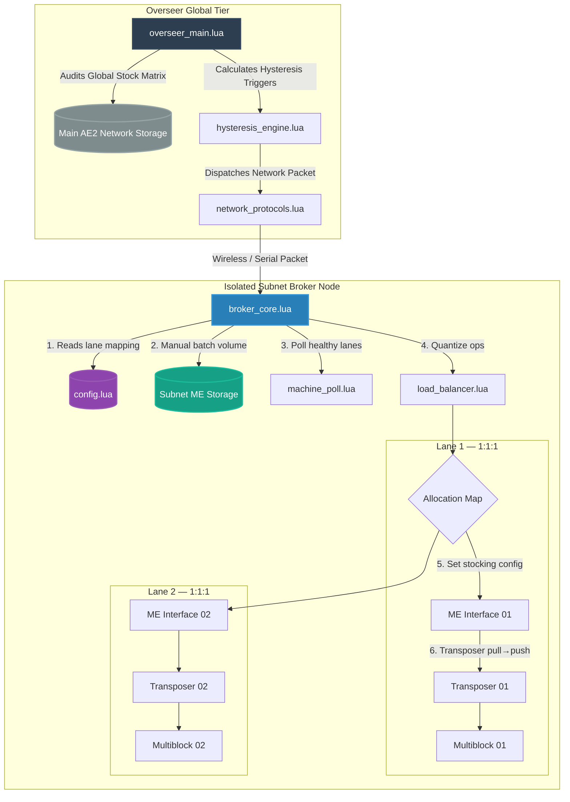
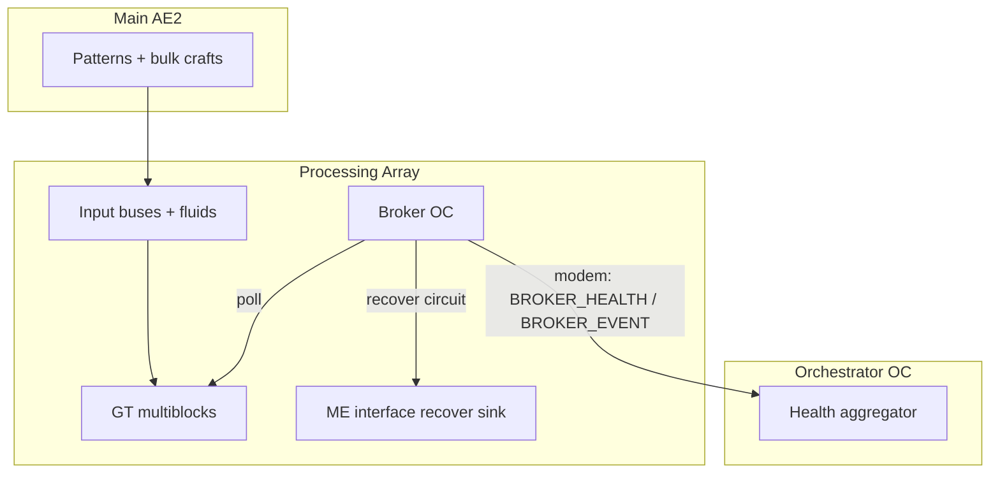

# AutoOS: Integrated Manufacturing Execution System & Statistical Process Control (MES-SPC)

## Advanced Project Architecture & Specification Document for GregTech New Horizons (GTNH)

AutoOS is a decoupled, highly modular automation framework designed for OpenComputers (OC). It bridges the gap between global warehouse stocking targets and localized, highly volatile multi-block processing pools without introducing execution lag or fractional fluid division lockups.

---

## 1. System Topology & Network Design




### The Architectural Blueprint

**Overseer Global Tier:** Performs high-level database scans against warehouse inventory. It functions purely as an asynchronous macro task dispatcher.

**Isolated Subnet Broker Nodes:** Micro-controllers physically dedicated to localized machine groupings. They operate entirely off immediate localized conditions and are decoupled from the core base infrastructure.

### Architecture Revision Addendum: Array Watch transposer topology

The broker no longer does lane-level stocking. AE2 handles bulk input delivery directly to machine buses/hatches. Broker-side lane wiring is now focused on safety + recovery:


| Per lane (multiblock) | Count | Role |
| --------------------- | ----- | ---- |
| **ME Interface (recover sink)** | per lane or shared | Receives recovered circuits from transposer after machine completes processing |
| **OC Transposer** | 1 | Recovery path only: input bus side → recover interface side |
| **gt_machine adapter** | 1 | Maintenance poll via `getSensorInformation()` + `setWorkAllowed(false)` on fault |

Default `interface_mode = "transposer"`: recovery is `transferItem(item_bus_side → recover_side)` only — no OC `me_interface` adapter required. Optional `per_lane` / `shared` modes add `setInterfaceConfiguration` clear when an OC adapter is wired.

Recovery is triggered by processing completion (`isMachineActive` falling edge), not generic idle state.

---

## 2. Advanced Process Flow & Lane Dispatch Loop

Bulk crafts land in **subnet ME storage** (main net patterns deposit fluids/items/circuits into the isolated subnet). Phase 3 will automate stock polling and token intercept; **v1 uses manual `process_batch(recipe_key, volume)`**.

### The Core Lifecycle (per batch)

1. **Pattern Encoding:** Recipes are programmed on the main net (or subnet) with integrated circuits as pattern inputs where required. Craft output is stored on the subnet — no separate circuit vault.
2. **Manual trigger (v1):** Operator or test harness calls `BrokerCore.process_batch("molten_soldering_alloy", 15000)` with the total fluid volume available in subnet storage.
3. **Safe pool build:** `machine_poll.lua` drops lanes with maintenance faults (`Problems: N > 0`) from the active pool.
4. **Quantized load-balancing:** Integer operations only — no fractional fluid division:

$$O = \left\lfloor \frac{\text{Total Volume}}{\text{fluid\_requirement}} \right\rfloor, \quad \text{ops per lane} = \left\lfloor \frac{O}{M} \right\rfloor + \text{remainder}$$

5. **Sequential lane execution (1:1:1):** For each healthy lane with `operations > 0`:
   - `component.proxy(interface_address)` → `setFluidInterfaceConfiguration(fluid_side, database_address, fluid_db_slot)` — AE2 subnets stock exact amount into interface buffer
   - `component.proxy(transposer_address)` → `transferFluid(fluid_pull_side, fluid_push_side, allocated_volume)`
   - Clear interface configuration (`setFluidInterfaceConfiguration(fluid_side)` with no db/slot)
6. **Phase 3 (future):** Passive ME interface polling, integrated-circuit token intercept, overseer craft triggers.

---

## 3. Directory Layout & Repository Structure

```
AutoOS/
├── orchestrator/                 # Phase 3 — Orchestrator OC (separate computer)
│   ├── orchestrator_config.lua   # subnet/me/broker addresses, ports, recipe_baselines + recipe_uid
│   ├── ae_recipe_registry.lua    # Living matched-recipe table + unique recipe_uid allocator + by_uid index
│   ├── registry_store.lua        # Tiny serializer: persist recipe_uid across reboots
│   ├── main_net_cache.lua        # Filtered main net ME poll → positive deltas
│   ├── craft_resolver.lua        # Delivery delta → recipe: UID token primary, circuit+fluid fallback
│   ├── main_net_craft.lua        # Main net getCraftables + craft request + job phase
│   ├── orchestrator.lua          # FSM: watch → resolve → DISPATCH_JOB → wait BROKER_STATUS
│   ├── orchestrator_main.lua     # OC entry: modem link + event loop
│   └── start.lua                 # Boot helper + wget list
├── overseer/                     # Phase 4 (future)
│   ├── overseer_main.lua         # Global stock checking loop; handles bulk requests
│   ├── inventory_cache.lua       # Caches global item and fluid metric snapshots
│   ├── hysteresis_engine.lua     # Evaluates high/low triggers for restocking rules
│   └── overseer_display.lua      # GPU panel: warehouse stock, crafts, broker links
├── subnet_broker/                # Broker OC (separate computer — lane hardware only)
│   ├── config.lua                # Per-lane OC addresses + recipe baselines (+ recipe_uid, orchestrator_address)
│   ├── broker_core.lua           # Lane dispatch: circuit push → fluid pump → clear
│   ├── broker_main.lua           # Phase 3 modem slave: DISPATCH_JOB → process_batch → BROKER_STATUS
│   ├── machine_poll.lua          # GT maintenance fault scanner; builds active/idle pools
│   ├── maintenance_parse.lua     # Parses getSensorInformation() fault strings
│   ├── load_balancer.lua         # Pure integer operation distribution
│   ├── circuit_manager.lua       # Per-lane circuit push/recover
│   ├── descriptor_cache.lua      # ME→OC database slot cache (circuits + fluid drops)
│   ├── diag.lua / test.lua / pre_p3_checklist.lua   # In-game smoke + gate tests
│   └── start.lua                 # Boot helper + wget list
└── shared/
    └── network_protocols.lua     # Pipe-delimited packet codec (copied into BOTH OC homes)
```

---

## 4. Engineering Specifications & Code Contracts

### Module: `subnet_broker/config.lua`

Provides localized environmental context to the broker. This file is the only file that changes between physical machine arrays.

```lua
local Config = {
    subnet_id = "universal_chemical_mv_01",
    main_net_channel = 105,
    interface_mode = "transposer",  -- default: no OC me_interface for recover
    shared_interface_address = nil, -- only when interface_mode == "shared" (optional OC clear)
    database_address = "database-00a12",  -- optional for watch mode; used by legacy dispatch

    machines = {
        {
            id = "machine_01",
            gt_address = "gt-uuid-01",
            transposer_address = "transposer-uuid-01",
            item_bus_side = 2,         -- transposer face touching GT input bus
            recover_side = 1,          -- transposer face touching ME interface (physical import)
            -- interface_address optional: only if OC adapter on ME interface (legacy dispatch / clear)
        },
        -- machine_02 .. machine_04: same fields, unique UUIDs per lane
    },

    constraints = {
        max_energy_tier = 2,
        recipe_baselines = {
            ["molten_soldering_alloy"] = {
                fluid_requirement = 1440,
                fluid_db_slot = 1,
                kind = "fluid",
            },
            ["polyethylene"] = {
                fluid_requirement = 1000,
                fluid_db_slot = 2,
                kind = "fluid",
            },
        },
    },
}

return Config
```

### Module: `subnet_broker/load_balancer.lua`

An isolated math engine executing integer division logic to ensure zero fractional allocations.

```lua
local LoadBalancer = {}

function LoadBalancer.calculate_distribution(active_pool, total_fluid, unit_requirement)
    local M = #active_pool
    if M == 0 then return nil, "No operational machines found." end

    local O = math.floor(total_fluid / unit_requirement)
    if O == 0 then return nil, "Batch volume falls short of minimum recipe boundaries." end
    
    local base_ops_per_machine = math.floor(O / M)
    local remainder_ops = O % M
    local distribution_map = {}
    
    for i, machine in ipairs(active_pool) do
        local assigned_ops = base_ops_per_machine
        
        -- Distribute leftover operations as clean, whole numbers (+1 per machine)
        if i <= remainder_ops then
            assigned_ops = assigned_ops + 1
        end
        
        distribution_map[machine.id] = {
            interface_address = machine.interface_address,
            transposer_address = machine.transposer_address,
            pull_side = machine.pull_side,
            push_side = machine.push_side,
            operations = assigned_ops,
            allocated_volume = assigned_ops * unit_requirement,
        }
    end
    
    return distribution_map, nil
end

return LoadBalancer
```

### Module: `subnet_broker/broker_core.lua`

Orchestrates safe-pool build, integer allocation, and **sequential per-lane hardware execution**.

```lua
-- Per lane (when execute_hardware = true):
--   1. iface.setFluidInterfaceConfiguration(fluid_side, database_address, fluid_db_slot)
--   2. tp.transferFluid(pull_side, push_side, allocated_volume)
--   3. iface.setFluidInterfaceConfiguration(fluid_side)  -- clear stocking slot

BrokerCore.process_batch("molten_soldering_alloy", 15000)
-- 15,000L / 1440L = 10 ops → 3, 3, 2, 2 across four healthy lanes
```

---

## 5. Operator Displays (GPU / Screen)

Both the **Overseer** and each **Subnet Broker** ship a dedicated on-computer display. The player should be able to glance at either screen and immediately answer: *What is happening? Is anything wrong? What happens next?*

### Design Rules (Both Displays)


| Rule                      | Rationale                                                                                                                                                                                              |
| ------------------------- | ------------------------------------------------------------------------------------------------------------------------------------------------------------------------------------------------------ |
| **Read-only**             | Displays render a snapshot built by the main loop. They never call `setWorkAllowed()`, ME craft APIs, or transposer/export hardware. A GPU fault must not stall control logic (`pcall` around render). |
| **Plain language**        | Use player-facing labels (`Soldering Alloy`, `REFILLING`, `Maintenance needed`) — not internal keys (`molten_soldering_alloy`) unless shown as secondary detail.                                       |
| **Status at a glance**    | Top line = overall health: `OK`, `WORKING`, `WAITING`, `FAULT`, or `OFFLINE`. Color when the GPU supports it (green / yellow / red).                                                                   |
| **Change-aware refresh**  | Redraw when meaningful state changes, not every tick. Target ≤ 2 full panel redraws per second during steady state (see `references/performance-pitfalls.md`).                                         |
| **One screen = one role** | Overseer PC shows warehouse macro view only. Broker PC shows its local machine pool only. No cross-role clutter.                                                                                       |


**Hardware:** Tier 2+ GPU recommended for color; minimum 80×25 characters (or scaled resolution with clipped layout). Headless operation remains supported when no GPU/screen is attached.

---

### 5.1 Subnet Broker Display (`broker_display.lua`)

**Audience:** Operator standing at the machine array — needs to see batch progress and per-machine health.

#### Layout (single page, fixed sections)

```text
┌─ AutoOS Broker ── universal_chemical_mv_01 ────────────┐
│ STATUS: WORKING          Uptime: 2h 14m    Tick: 4821 │
├─ Current Job ──────────────────────────────────────────┤
│ Recipe:    Soldering Alloy (Circuit 14)                │
│ Batch:     15,000 L  →  10 operations total            │
│ Progress:  6 / 10 ops complete (4 remaining)           │
│ Phase:     Running machines — recovering circuits      │
├─ Machine Pool ─────────────────────────────────────────┤
│ ID         Ops      State        Circuit   Maintenance │
│ reactor_01 1/3      PROCESSING   #14       OK         │
│ reactor_02 2/3      PROCESSING   #14       OK         │
│ reactor_03 2/2      IDLE         #14       OK         │
│ reactor_04 1/2      FAULT        —         NEEDS TAPE │
├─ Subnet Buffer ────────────────────────────────────────┤
│ Fluid waiting:  0 L Soldering Alloy                    │
│ Token:          none (last: Circuit 14, 3m ago)       │
├─ Last Action ──────────────────────────────────────────┤
│ reactor_04 removed from pool — maintenance detected    │
│ Ops redistributed to 3 healthy machines (4,3,3)        │
└────────────────────────────────────────────────────────┘
```

#### Fields (what each means for the player)


| Section       | Field           | User-visible meaning                                                                                                                                                                                                                         |
| ------------- | --------------- | -------------------------------------------------------------------------------------------------------------------------------------------------------------------------------------------------------------------------------------------- |
| Header        | `STATUS`        | **OK** = idle, healthy. **WORKING** = batch in progress. **WAITING** = batch queued, no fluid yet. **FAULT** = at least one machine fault or unrecoverable error. **HALTED** = broker stopped the run (volume too low, no healthy machines). |
| Current Job   | `Recipe`        | Human name + circuit number from the intercepted token.                                                                                                                                                                                      |
| Current Job   | `Batch`         | Total fluid received and how many GT recipe cycles that represents.                                                                                                                                                                          |
| Current Job   | `Progress`      | Ops finished vs total across the whole pool.                                                                                                                                                                                                 |
| Current Job   | `Phase`         | Plain step name: `Detecting token`, `Allocating`, `Injecting circuits`, `Running machines`, `Recovering circuits`, `Complete`.                                                                                                               |
| Machine Pool  | `Ops`           | `done/assigned` for this machine (e.g. `2/3` = two of three assigned cycles finished).                                                                                                                                                       |
| Machine Pool  | `State`         | **IDLE**, **PROCESSING**, **DISABLED** (0 ops), **FAULT** (maintenance/structure), **OFF** (work not allowed).                                                                                                                               |
| Machine Pool  | `Circuit`       | Programmed circuit in that machine’s input bus, or `—` if none.                                                                                                                                                                              |
| Machine Pool  | `Maintenance`   | **OK** or short fault text from `getSensorInformation()` (e.g. `NEEDS WRENCH`).                                                                                                                                                              |
| Subnet Buffer | `Fluid waiting` | Unassigned fluid still in the subnet ME / buffer.                                                                                                                                                                                            |
| Subnet Buffer | `Token`         | Whether a craft token is present; when absent, show when the last one was seen.                                                                                                                                                              |
| Last Action   | (message)       | Most recent broker decision in full sentences (redistribution, halt reason, craft complete).                                                                                                                                                 |


#### Broker status colors


| Status  | Color        | When                                        |
| ------- | ------------ | ------------------------------------------- |
| OK      | Green        | Idle, all machines healthy                  |
| WORKING | White / cyan | Active batch                                |
| WAITING | Yellow       | Expecting AE delivery                       |
| FAULT   | Red          | Maintenance or hard error                   |
| HALTED  | Red          | Run aborted with reason on Last Action line |


---

### 5.2 Overseer Display (`overseer_display.lua`)

**Audience:** Operator at the main base — needs warehouse stocking health and whether subnet brokers are responding.

#### Layout (summary page; arrow keys or number keys cycle **Stock** / **Brokers** / **Log** when screen height allows)

**Page 1 — Stock (default)**

```text
┌─ AutoOS Overseer ── Main ME Network ───────────────────┐
│ STATUS: REFILLING        Targets: 8    Brokers: 3/3    │
├─ Stock Targets ────────────────────────────────────────┤
│ Product              Stock      Band          State    │
│ Soldering Alloy      142,800    100k–200k     OK       │
│ Polyethylene         4,200 L    8k–32k L     LOW      │
│ Ethylene             28,000 L   20k–80k L     OK       │
│ Hydrochloric Acid    1,200      500–2,000    REFILLING│
├─ Active Crafts (Main ME) ────────────────────────────────┤
│ Polyethylene         requesting 28,000 L  (12s ago)    │
│ Hydrochloric Acid    computing…          (CPU 1)       │
├─ Next Check ───────────────────────────────────────────┤
│ Inventory scan in 8s    Last tick: 312ms               │
└────────────────────────────────────────────────────────┘
```

**Page 2 — Brokers**

```text
┌─ AutoOS Overseer ── Subnet Brokers ──────────────────────┐
│ STATUS: OK               Modem port 105                │
├─ Broker Links ─────────────────────────────────────────┤
│ Subnet ID                 Link      Last Seen   Job    │
│ universal_chemical_mv_01  ONLINE    2s ago      WORK  │
│ dist_tower_array_02       ONLINE    5s ago      IDLE  │
│ ebf_mv_south              OFFLINE   4m ago      —     │
├─ Recent Dispatches ────────────────────────────────────┤
│ TRIGGER_CRAFT Polyethylene → universal_chemical_mv_01  │
│   3m ago — broker acknowledged                         │
└────────────────────────────────────────────────────────┘
```

**Page 3 — Log (optional, last 5 lines)**

```text
┌─ AutoOS Overseer ── Event Log ─────────────────────────┐
│ 14:02  Polyethylene below low — craft requested        │
│ 14:02  Packet sent to universal_chemical_mv_01         │
│ 14:05  ebf_mv_south heartbeat missed (3x) — OFFLINE    │
│ 14:06  Hydrochloric Acid stock restored — IDLE         │
└────────────────────────────────────────────────────────┘
```

#### Fields (what each means for the player)


| Section       | Field       | User-visible meaning                                                                                                                |
| ------------- | ----------- | ----------------------------------------------------------------------------------------------------------------------------------- |
| Header        | `STATUS`    | **OK** = all targets satisfied. **REFILLING** = at least one craft in flight. **ALERT** = broker offline or repeated craft failure. |
| Header        | `Targets`   | Count of products under hysteresis rules.                                                                                           |
| Header        | `Brokers`   | `online/total` subnet links.                                                                                                        |
| Stock         | `Product`   | ME label (player-facing name).                                                                                                      |
| Stock         | `Stock`     | Current amount (items or `L` for fluids).                                                                                           |
| Stock         | `Band`      | Configured `low`–`high` hysteresis band.                                                                                            |
| Stock         | `State`     | **OK** (inside band), **LOW** (below low, will trigger), **REFILLING** (craft active), **HIGH** (above high — idle).                |
| Active Crafts | (rows)      | What the Overseer asked AE to craft and job phase (`requesting`, `computing`, `delivering`).                                        |
| Brokers       | `Link`      | **ONLINE** if heartbeat within timeout; **OFFLINE** otherwise.                                                                      |
| Brokers       | `Last Seen` | Time since last `pong` or `craft_done` from that broker.                                                                            |
| Brokers       | `Job`       | Broker-reported phase: **IDLE**, **WORK**, **FAULT** (mirrors broker header STATUS).                                                |
| Log           | (lines)     | Short, timestamped sentences — same tone as broker Last Action.                                                                     |


#### Overseer status colors


| Status    | Color  | When                                                          |
| --------- | ------ | ------------------------------------------------------------- |
| OK        | Green  | All stock in band, all brokers online                         |
| REFILLING | Yellow | Crafts in progress, no hard faults                            |
| ALERT     | Red    | Broker offline, craft failed, or stock critical with no craft |


---

### 5.3 Shared Display Contract

Both modules expose the same pattern (matches the proven `legacy/display.lua` approach):

```lua
-- Built by overseer_main / broker_core each tick — display never polls hardware
local snapshot = {
  title = "AutoOS Broker",
  status = "WORKING",           -- OK | WORKING | WAITING | FAULT | HALTED | REFILLING | ALERT
  status_reason = "...",        -- one-line plain English
  uptime = 8042,
  tick = 4821,
  job = { ... },                -- broker only
  machines = { ... },           -- broker only
  stock_targets = { ... },      -- overseer only
  brokers = { ... },            -- overseer only
  last_action = "...",
}

display:render(snapshot)        -- pcall wrapped by main loop
```

Keyboard (when implemented): **1 / 2 / 3** or **← / →** cycle Overseer pages; broker stays single-page in v1.

---

## 6. Development Model Prompts

Copy and paste these prompts directly into your code generation models to build out the full application suite:

### Phase 1 Prompt (Config & Math)

Write two compliant Lua modules for an OpenComputers project named AutoOS running in GregTech New Horizons: `subnet_broker/config.lua` and `subnet_broker/load_balancer.lua`. Ensure `config.lua` returns a dictionary table mapping local machine structures and recipe baseline quantities. Ensure `load_balancer.lua` calculates allocations strictly via integer floor operations, avoiding any raw volume division.

### Phase 2 Prompt (Hardware & Control)

Write `subnet_broker/machine_poll.lua` and `subnet_broker/maintenance_parse.lua`. `machine_poll` must verify active multiblock maintenance flags via `gt_machine.getSensorInformation()` and drop faulted lanes from the active pool. Rewrite `broker_core.lua` for the **1:1:1 topology**: per-lane `component.proxy` of ME Interface and Transposer, `setFluidInterfaceConfiguration` → `transferFluid` → clear interface. No `circuit_manager` or centralized vault.

### Phase 3 (Revised) — Array Watch mode

Phase 3 now keeps the two-OC topology, but removes OC-side recipe dispatch:

| Computer | Home | Role |
| -------- | ---- | ---- |
| **Orchestrator OC** | `/home/orchestrator/` | Aggregates broker telemetry and presents status. No recipe registry, no lane dispatch. |
| **Broker OC** | `/home/subnet_broker/` | Per-array watcher. Polls machine health, shuts down faulted lanes, and recovers circuits from input buses when processing completes. |



AE2 handles bulk stock/craft volume. OC logic is universal:

1. Parse maintenance faults from `getSensorInformation()`
2. Call `setWorkAllowed(false)` on faulted lanes
3. On processing complete (`isMachineActive: true -> false`), recover circuit from input bus back to ME
4. Emit broker health/event telemetry for operator display

**Wire protocol** (`shared/network_protocols.lua`, copied into both OC homes):

```text
BROKER_HEALTH|subnet_id|machine_id|state|detail
BROKER_EVENT |subnet_id|event|label|volume|job_id
  event: machine_fault | circuit_recovered | circuit_recover_failed | ...
```

Boot: `lua /home/orchestrator/orchestrator_main.lua` on orchestrator and
`lua /home/subnet_broker/broker_main.lua` on broker.

### Phase 4 Prompt (Macro Overseer Layer)

Write `overseer/overseer_main.lua` and `overseer/hysteresis_engine.lua`. The hysteresis engine must analyze stock metrics to issue `TRIGGER_CRAFT` signals when inventories fall beneath minimum targets. `overseer_main` must query the central primary network stock lists, process rules using the engine, issue `requestCrafting` tasks to AE2, and push network alert packets to the dedicated Subnet Brokers.

### Phase 5 Prompt (Operator Displays)

Write `subnet_broker/broker_display.lua` and `overseer/overseer_display.lua` per README §5. Each module is read-only, accepts a snapshot table from its parent main loop, uses plain-language labels, color-coded STATUS lines, and change-aware redraw. Broker: single-page batch + machine pool view. Overseer: Stock / Brokers / Log pages with keyboard navigation. Wrap render in `pcall` from the parent; headless when no GPU. Follow `references/OC-GTNH-docs-main/docs/components/gpu.lua` and `references/performance-pitfalls.md`.

---

## 7. Verification & In-Game Testing Protocol

### The Drop-In Test

Update `config.lua` addresses to map to an EBF or Assembly Line array. Verify that `broker_core.lua` runs the new hardware footprint smoothly without a single line of internal code modifications.

### The Hand-Off Test

With 3,000 L of Ethylene in subnet storage, run `process_batch("polyethylene", 3000)`. Verify integer ops **1, 1, 1, 0** (1,000 L per lane × three machines), each lane’s transposer moves only its share via its dedicated interface, and `machine_04` shows **0 ops — idle**.

### The Safe Failure Test

Trigger a maintenance fault on Machine #2 mid-craft. Verify that on the very next dispatch cycle, `machine_poll.lua` intercepts the fault code and the load-balancer dynamically scales operations onto the remaining healthy machines without halting execution.