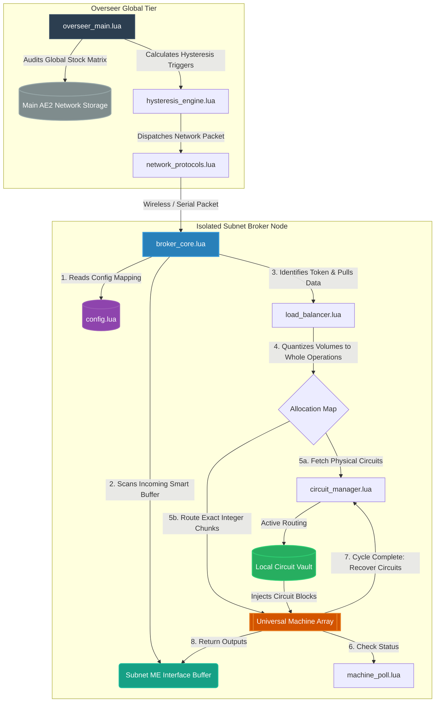

# AutoOS: Integrated Manufacturing Execution System & Statistical Process Control (MES-SPC)

## Advanced Project Architecture & Specification Document for GregTech New Horizons (GTNH)

AutoOS is a decoupled, highly modular automation framework designed for OpenComputers (OC). It bridges the gap between global warehouse stocking targets and localized, highly volatile multi-block processing pools without introducing execution lag or fractional fluid division lockups.

---

## 1. System Topology & Network Design



### The Architectural Blueprint

**Overseer Global Tier:** Performs high-level database scans against warehouse inventory. It functions purely as an asynchronous macro task dispatcher.

**Isolated Subnet Broker Nodes:** Micro-controllers physically dedicated to localized machine groupings. They operate entirely off immediate localized conditions and are decoupled from the core base infrastructure.

---

## 2. Advanced Process Flow & The "Token-Based" Universal Loop

To achieve a truly universal array where any multi-block can process any recipe on demand without static hardcoded logic mappings, AutoOS intercepts execution through the **AE2 Pattern Encoding Trick**.

### The Core Lifecycle

1. **Pattern Encoding:** Every automated recipe is programmed into your Main Net AE2 Pattern Terminal with its required Integrated Circuit included as a physical input item ingredient.
2. **Batch Influx:** When a craft triggers (via automated restocking or a direct player terminal click), AE2 dumps the raw items, fluids, and the physical circuit "Token" into the Subnet's Main ME Interface Buffer.
3. **Passive Intercept:** The Subnet Broker continuously polls this buffer interface. It doesn't care where the job originated. When it catches an incoming `gt.integrated_circuit` item, it intercepts its configuration tag value (e.g., Circuit 14) to identify the target recipe and immediately evacuates the physical token back to network storage.
4. **Quantized Load-Balancing Math:** To prevent fractional-volume fluid splitting (which bricks GregTech multiblocks), the broker translates total incoming bulk volumes into clean, discrete integer operations ($O$) before allocating them down to individual machines:

$$\text{Operations Per Machine} = \left\lfloor \frac{\text{Total Available Operations}}{\text{Active Machine Pool Size}} \right\rfloor$$

5. **Dynamic Vault Dispatch:** The broker instructs its local Circuit Vault to push physical circuit configuration blocks into the input buses of the assigned machines before any raw materials are moved. Once processing concludes, circuits are swept back to the vault automatically.

---

## 3. Directory Layout & Repository Structure

```
AutoOS/
├── overseer/
│   ├── overseer_main.lua         # Global stock checking loop; handles bulk requests
│   ├── inventory_cache.lua       # Caches global item and fluid metric snapshots
│   └── hysteresis_engine.lua     # Evaluates high/low triggers for restocking rules
├── subnet_broker/
│   ├── config.lua                # LOCAL CONFIG: Unique subnet hardware & recipe baselines
│   ├── broker_core.lua           # Main Subnet polling loop and processing coordinator
│   ├── machine_poll.lua          # Diagnostics and GTNH maintenance fault scanner
│   ├── circuit_manager.lua       # Handles inventory manipulation of physical circuit blocks
│   └── load_balancer.lua         # Pure math module executing quantized integer division
└── shared/
    └── network_protocols.lua     # Serialized JSON packet definitions for Inter-OS comms
```

---

## 4. Engineering Specifications & Code Contracts

### Module: `subnet_broker/config.lua`

Provides localized environmental context to the broker. This file is the only file that changes between physical machine arrays.

```lua
local Config = {
    subnet_id = "universal_chemical_mv_01",
    main_net_channel = 105,
    circuit_vault_address = "vault-chest-00a12",
    
    machines = {
        { id = "reactor_01", bus_in = "bus-in-address-01", bus_out = "bus-out-address-01" },
        { id = "reactor_02", bus_in = "bus-in-address-02", bus_out = "bus-out-address-02" },
        { id = "reactor_03", bus_in = "bus-in-address-03", bus_out = "bus-out-address-03" },
        { id = "reactor_04", bus_in = "bus-in-address-04", bus_out = "bus-out-address-04" }
    },
    
    constraints = {
        max_energy_tier = 2, -- MV Level Cap
        recipe_baselines = {
            ["molten_soldering_alloy"] = { fluid_requirement = 1440 }, -- Must step in clean 1440L blocks
            ["polyethylene"]           = { fluid_requirement = 1000 }  -- Must step in clean 1000L blocks
        }
    }
}

return Config
```

### Module: `subnet_broker/load_balancer.lua`

An isolated math engine executing integer division logic to ensure zero fractional allocations.

```lua
local LoadBalancer = {}

function LoadBalancer.calculate_distribution(active_pool, total_fluid, unit_requirement)
    local M = #active_pool
    if M == 0 then return nil, "No operational machines found." end

    local O = math.floor(total_fluid / unit_requirement)
    if O == 0 then return nil, "Batch volume falls short of minimum recipe boundaries." end
    
    local base_ops_per_machine = math.floor(O / M)
    local remainder_ops = O % M
    local distribution_map = {}
    
    for i, machine in ipairs(active_pool) do
        local assigned_ops = base_ops_per_machine
        
        -- Distribute leftover operations as clean, whole numbers (+1 per machine)
        if i <= remainder_ops then
            assigned_ops = assigned_ops + 1
        end
        
        distribution_map[machine.id] = {
            address = machine.bus_in,
            operations = assigned_ops,
            allocated_volume = assigned_ops * unit_requirement
        }
    end
    
    return distribution_map, nil
end

return LoadBalancer
```

### Module: `subnet_broker/broker_core.lua`

The primary operational orchestrator loop handling intercept and dispatch events.

```lua
local config   = require("config")
local balancer = require("load_balancer")

local BrokerCore = {}

function BrokerCore.process_batch(circuit_token_id, current_buffer_volume)
    print(string.format("\n[AutoOS] Subnet '%s' Initializing Universal Run...", config.subnet_id))
    
    local recipe_rules = config.constraints.recipe_baselines[circuit_token_id]
    local minimum_unit = recipe_rules and recipe_rules.fluid_requirement or 1000
    
    -- Fetches operational status maps via machine_poll.lua
    local active_pool = {}
    for _, m in ipairs(config.machines) do
        table.insert(active_pool, m) 
    end
    
    -- Evaluate the quantized operation allocations
    local allocations, err = balancer.calculate_distribution(active_pool, current_buffer_volume, minimum_unit)
    if not allocations then
        print("[Execution Halted] " .. tostring(err))
        return false
    end
    
    -- Dispatch Routine Interface Execution Loop
    for m_id, target in pairs(allocations) do
        if target.operations > 0 then
            print(string.format(" -> [Dispatch -> %s] Routing %d Operations (%dL) to Input Bus [%s]", 
                m_id, target.operations, target.allocated_volume, target.address))
        else
            print(string.format(" -> [Dispatch -> %s] 0 Ops allocated. Machine safe and clean.", m_id))
        end
    end
end

-- Verify 15,000L of Soldering Alloy over 4 machines.
-- 15,000L / 1440L = 10 operations total. 
-- 10 operations over 4 machines must resolve to: 3, 3, 2, 2. No fractions!
BrokerCore.process_batch("molten_soldering_alloy", 15000)
```

---

## 5. Development Model Prompts

Copy and paste these prompts directly into your code generation models to build out the full application suite:

### Phase 1 Prompt (Config & Math)

Write two compliant Lua modules for an OpenComputers project named AutoOS running in GregTech New Horizons: `subnet_broker/config.lua` and `subnet_broker/load_balancer.lua`. Ensure `config.lua` returns a dictionary table mapping local machine structures and recipe baseline quantities. Ensure `load_balancer.lua` calculates allocations strictly via integer floor operations, avoiding any raw volume division.

### Phase 2 Prompt (Hardware & Control)

Write two modular Lua scripts for OpenComputers: `subnet_broker/machine_poll.lua` and `subnet_broker/circuit_manager.lua`. `machine_poll` must verify active multiblock maintenance flags via the OpenComputers component API to drop broken machines from the active pool. `circuit_manager` must push and recover physical Integrated Circuits from a local vault container directly to specified multiblock bus addresses on demand.

### Phase 3 Prompt (Orchestrator Loop)

Write the master execution script `subnet_broker/broker_core.lua` for an OpenComputers system. It must implement a passive background loop polling the subnet's local ME Interface. It must intercept arriving integrated circuit items as craft tokens, instantly clear them from the interface, resolve total batch fluid sizing via `load_balancer` math, trigger `circuit_manager` configuration changes, and handle the raw ingredient distribution without locking up.

### Phase 4 Prompt (Macro Overseer Layer)

Write `overseer/overseer_main.lua` and `overseer/hysteresis_engine.lua`. The hysteresis engine must analyze stock metrics to issue `TRIGGER_CRAFT` signals when inventories fall beneath minimum targets. `overseer_main` must query the central primary network stock lists, process rules using the engine, issue `requestCrafting` tasks to AE2, and push network alert packets to the dedicated Subnet Brokers.

---

## 6. Verification & In-Game Testing Protocol

### The Drop-In Test

Update `config.lua` addresses to map to an EBF or Assembly Line array. Verify that `broker_core.lua` runs the new hardware footprint smoothly without a single line of internal code modifications.

### The Hand-Off Test

Manually insert 3,000 L of Ethylene and an Integrated Circuit (Configuration 18) directly into the Subnet's ME Interface. Verify that the computer extracts the token, splits the batch cleanly into three 1,000 L operations across three separate machines, and leaves the fourth machine empty and completely clean.

### The Safe Failure Test

Trigger a maintenance fault on Machine #2 mid-craft. Verify that on the very next dispatch cycle, `machine_poll.lua` intercepts the fault code and the load-balancer dynamically scales operations onto the remaining healthy machines without halting execution.
