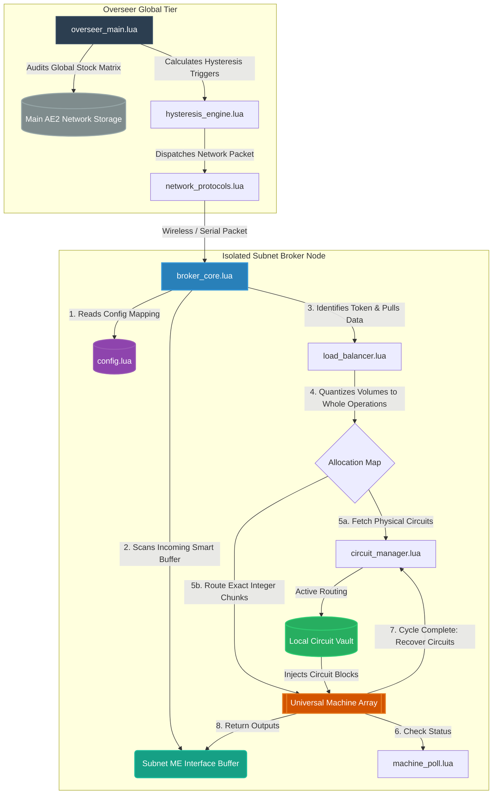

# AutoOS: Integrated Manufacturing Execution System & Statistical Process Control (MES-SPC)

## Advanced Project Architecture & Specification Document for GregTech New Horizons (GTNH)

AutoOS is a decoupled, highly modular automation framework designed for OpenComputers (OC). It bridges the gap between global warehouse stocking targets and localized, highly volatile multi-block processing pools without introducing execution lag or fractional fluid division lockups.

---

## 1. System Topology & Network Design




### The Architectural Blueprint

**Overseer Global Tier:** Performs high-level database scans against warehouse inventory. It functions purely as an asynchronous macro task dispatcher.

**Isolated Subnet Broker Nodes:** Micro-controllers physically dedicated to localized machine groupings. They operate entirely off immediate localized conditions and are decoupled from the core base infrastructure.

### Physical Wiring Assumption (v1)

Each multiblock in a machine pool is wired **independently**:


| Per multiblock        | Count | Role                                                                |
| --------------------- | ----- | ------------------------------------------------------------------- |
| **Item input bus**    | 1     | Receives programmed circuits and solid inputs for that machine only |
| **Fluid input hatch** | 1     | Receives fluid batches routed to that machine only                  |


There is **no shared input bus or shared fluid hatch** across machines in v1. A four-machine array means four buses, four hatches, and four `gt_machine` adapters (or MFU links). The broker’s load balancer assigns **integer operation budgets per machine**; physical routing delivers each machine’s share to **its** bus and hatch (via subnet ME export, transposer, or equivalent — defined per deployment in `config.lua`).

Future experiments (e.g. a common feed tank with per-machine hatches still on separate multis) are out of scope until v1 is validated in-game.

---

## 2. Advanced Process Flow & The "Token-Based" Universal Loop

To achieve a truly universal array where any multi-block can process any recipe on demand without static hardcoded logic mappings, AutoOS intercepts execution through the **AE2 Pattern Encoding Trick**.

### The Core Lifecycle

1. **Pattern Encoding:** Every automated recipe is programmed into your Main Net AE2 Pattern Terminal with its required Integrated Circuit included as a physical input item ingredient.
2. **Batch Influx:** When a craft triggers (via automated restocking or a direct player terminal click), AE2 dumps the raw items, fluids, and the physical circuit "Token" into the Subnet's Main ME Interface Buffer.
3. **Passive Intercept:** The Subnet Broker continuously polls this buffer interface. It doesn't care where the job originated. When it catches an incoming `gt.integrated_circuit` item, it intercepts its configuration tag value (e.g., Circuit 14) to identify the target recipe and immediately evacuates the physical token back to network storage.
4. **Quantized Load-Balancing Math:** To prevent fractional-volume fluid splitting (which bricks GregTech multiblocks), the broker translates total incoming bulk volumes into clean, discrete integer operations ($O$) before allocating them down to individual machines:

$$\text{Operations Per Machine} = \left\lfloor \frac{\text{Total Available Operations}}{\text{Active Machine Pool Size}} \right\rfloor$$

1. **Dynamic Vault Dispatch:** The broker instructs its local Circuit Vault to push physical circuit configuration blocks into **each machine’s dedicated input bus** before raw materials are moved to **that machine’s fluid hatch**. Once processing concludes, circuits are swept back to the vault automatically.

---

## 3. Directory Layout & Repository Structure

```
AutoOS/
├── overseer/
│   ├── overseer_main.lua         # Global stock checking loop; handles bulk requests
│   ├── inventory_cache.lua       # Caches global item and fluid metric snapshots
│   ├── hysteresis_engine.lua     # Evaluates high/low triggers for restocking rules
│   └── overseer_display.lua      # GPU panel: warehouse stock, crafts, broker links
├── subnet_broker/
│   ├── config.lua                # LOCAL CONFIG: Unique subnet hardware & recipe baselines
│   ├── broker_core.lua           # Main Subnet polling loop and processing coordinator
│   ├── broker_display.lua        # GPU panel: batch job, machine pool, faults
│   ├── machine_poll.lua          # Diagnostics and GTNH maintenance fault scanner
│   ├── circuit_manager.lua       # Handles inventory manipulation of physical circuit blocks
│   └── load_balancer.lua         # Pure math module executing quantized integer division
└── shared/
    └── network_protocols.lua     # Serialized JSON packet definitions for Inter-OS comms
```

---

## 4. Engineering Specifications & Code Contracts

### Module: `subnet_broker/config.lua`

Provides localized environmental context to the broker. This file is the only file that changes between physical machine arrays.

```lua
local Config = {
    subnet_id = "universal_chemical_mv_01",
    main_net_channel = 105,
    circuit_vault_address = "vault-chest-00a12",
    
    machines = {
        -- v1: one item input bus + one fluid input hatch per multiblock
        { id = "reactor_01", gt_address = "gt-uuid-01", bus_in = "bus-in-01", hatch_fluid = "hatch-fluid-01" },
        { id = "reactor_02", gt_address = "gt-uuid-02", bus_in = "bus-in-02", hatch_fluid = "hatch-fluid-02" },
        { id = "reactor_03", gt_address = "gt-uuid-03", bus_in = "bus-in-03", hatch_fluid = "hatch-fluid-03" },
        { id = "reactor_04", gt_address = "gt-uuid-04", bus_in = "bus-in-04", hatch_fluid = "hatch-fluid-04" },
    },
    
    constraints = {
        max_energy_tier = 2, -- MV Level Cap
        recipe_baselines = {
            ["molten_soldering_alloy"] = { fluid_requirement = 1440 }, -- Must step in clean 1440L blocks
            ["polyethylene"]           = { fluid_requirement = 1000 }  -- Must step in clean 1000L blocks
        }
    }
}

return Config
```

### Module: `subnet_broker/load_balancer.lua`

An isolated math engine executing integer division logic to ensure zero fractional allocations.

```lua
local LoadBalancer = {}

function LoadBalancer.calculate_distribution(active_pool, total_fluid, unit_requirement)
    local M = #active_pool
    if M == 0 then return nil, "No operational machines found." end

    local O = math.floor(total_fluid / unit_requirement)
    if O == 0 then return nil, "Batch volume falls short of minimum recipe boundaries." end
    
    local base_ops_per_machine = math.floor(O / M)
    local remainder_ops = O % M
    local distribution_map = {}
    
    for i, machine in ipairs(active_pool) do
        local assigned_ops = base_ops_per_machine
        
        -- Distribute leftover operations as clean, whole numbers (+1 per machine)
        if i <= remainder_ops then
            assigned_ops = assigned_ops + 1
        end
        
        distribution_map[machine.id] = {
            address = machine.bus_in,
            operations = assigned_ops,
            allocated_volume = assigned_ops * unit_requirement
        }
    end
    
    return distribution_map, nil
end

return LoadBalancer
```

### Module: `subnet_broker/broker_core.lua`

The primary operational orchestrator loop handling intercept and dispatch events.

```lua
local config   = require("config")
local balancer = require("load_balancer")

local BrokerCore = {}

function BrokerCore.process_batch(circuit_token_id, current_buffer_volume)
    print(string.format("\n[AutoOS] Subnet '%s' Initializing Universal Run...", config.subnet_id))
    
    local recipe_rules = config.constraints.recipe_baselines[circuit_token_id]
    local minimum_unit = recipe_rules and recipe_rules.fluid_requirement or 1000
    
    -- Fetches operational status maps via machine_poll.lua
    local active_pool = {}
    for _, m in ipairs(config.machines) do
        table.insert(active_pool, m) 
    end
    
    -- Evaluate the quantized operation allocations
    local allocations, err = balancer.calculate_distribution(active_pool, current_buffer_volume, minimum_unit)
    if not allocations then
        print("[Execution Halted] " .. tostring(err))
        return false
    end
    
    -- Dispatch Routine Interface Execution Loop
    for m_id, target in pairs(allocations) do
        if target.operations > 0 then
            print(string.format(" -> [Dispatch -> %s] Routing %d Operations (%dL) to Input Bus [%s]", 
                m_id, target.operations, target.allocated_volume, target.address))
        else
            print(string.format(" -> [Dispatch -> %s] 0 Ops allocated. Machine safe and clean.", m_id))
        end
    end
end

-- Verify 15,000L of Soldering Alloy over 4 machines.
-- 15,000L / 1440L = 10 operations total. 
-- 10 operations over 4 machines must resolve to: 3, 3, 2, 2. No fractions!
BrokerCore.process_batch("molten_soldering_alloy", 15000)
```

---

## 5. Operator Displays (GPU / Screen)

Both the **Overseer** and each **Subnet Broker** ship a dedicated on-computer display. The player should be able to glance at either screen and immediately answer: *What is happening? Is anything wrong? What happens next?*

### Design Rules (Both Displays)


| Rule                      | Rationale                                                                                                                                                                                              |
| ------------------------- | ------------------------------------------------------------------------------------------------------------------------------------------------------------------------------------------------------ |
| **Read-only**             | Displays render a snapshot built by the main loop. They never call `setWorkAllowed()`, ME craft APIs, or transposer/export hardware. A GPU fault must not stall control logic (`pcall` around render). |
| **Plain language**        | Use player-facing labels (`Soldering Alloy`, `REFILLING`, `Maintenance needed`) — not internal keys (`molten_soldering_alloy`) unless shown as secondary detail.                                       |
| **Status at a glance**    | Top line = overall health: `OK`, `WORKING`, `WAITING`, `FAULT`, or `OFFLINE`. Color when the GPU supports it (green / yellow / red).                                                                   |
| **Change-aware refresh**  | Redraw when meaningful state changes, not every tick. Target ≤ 2 full panel redraws per second during steady state (see `references/performance-pitfalls.md`).                                         |
| **One screen = one role** | Overseer PC shows warehouse macro view only. Broker PC shows its local machine pool only. No cross-role clutter.                                                                                       |


**Hardware:** Tier 2+ GPU recommended for color; minimum 80×25 characters (or scaled resolution with clipped layout). Headless operation remains supported when no GPU/screen is attached.

---

### 5.1 Subnet Broker Display (`broker_display.lua`)

**Audience:** Operator standing at the machine array — needs to see batch progress and per-machine health.

#### Layout (single page, fixed sections)

```text
┌─ AutoOS Broker ── universal_chemical_mv_01 ────────────┐
│ STATUS: WORKING          Uptime: 2h 14m    Tick: 4821 │
├─ Current Job ──────────────────────────────────────────┤
│ Recipe:    Soldering Alloy (Circuit 14)                │
│ Batch:     15,000 L  →  10 operations total            │
│ Progress:  6 / 10 ops complete (4 remaining)           │
│ Phase:     Running machines — recovering circuits      │
├─ Machine Pool ─────────────────────────────────────────┤
│ ID         Ops      State        Circuit   Maintenance │
│ reactor_01 1/3      PROCESSING   #14       OK         │
│ reactor_02 2/3      PROCESSING   #14       OK         │
│ reactor_03 2/2      IDLE         #14       OK         │
│ reactor_04 1/2      FAULT        —         NEEDS TAPE │
├─ Subnet Buffer ────────────────────────────────────────┤
│ Fluid waiting:  0 L Soldering Alloy                    │
│ Token:          none (last: Circuit 14, 3m ago)       │
├─ Last Action ──────────────────────────────────────────┤
│ reactor_04 removed from pool — maintenance detected    │
│ Ops redistributed to 3 healthy machines (4,3,3)        │
└────────────────────────────────────────────────────────┘
```

#### Fields (what each means for the player)


| Section       | Field           | User-visible meaning                                                                                                                                                                                                                         |
| ------------- | --------------- | -------------------------------------------------------------------------------------------------------------------------------------------------------------------------------------------------------------------------------------------- |
| Header        | `STATUS`        | **OK** = idle, healthy. **WORKING** = batch in progress. **WAITING** = batch queued, no fluid yet. **FAULT** = at least one machine fault or unrecoverable error. **HALTED** = broker stopped the run (volume too low, no healthy machines). |
| Current Job   | `Recipe`        | Human name + circuit number from the intercepted token.                                                                                                                                                                                      |
| Current Job   | `Batch`         | Total fluid received and how many GT recipe cycles that represents.                                                                                                                                                                          |
| Current Job   | `Progress`      | Ops finished vs total across the whole pool.                                                                                                                                                                                                 |
| Current Job   | `Phase`         | Plain step name: `Detecting token`, `Allocating`, `Injecting circuits`, `Running machines`, `Recovering circuits`, `Complete`.                                                                                                               |
| Machine Pool  | `Ops`           | `done/assigned` for this machine (e.g. `2/3` = two of three assigned cycles finished).                                                                                                                                                       |
| Machine Pool  | `State`         | **IDLE**, **PROCESSING**, **DISABLED** (0 ops), **FAULT** (maintenance/structure), **OFF** (work not allowed).                                                                                                                               |
| Machine Pool  | `Circuit`       | Programmed circuit in that machine’s input bus, or `—` if none.                                                                                                                                                                              |
| Machine Pool  | `Maintenance`   | **OK** or short fault text from `getSensorInformation()` (e.g. `NEEDS WRENCH`).                                                                                                                                                              |
| Subnet Buffer | `Fluid waiting` | Unassigned fluid still in the subnet ME / buffer.                                                                                                                                                                                            |
| Subnet Buffer | `Token`         | Whether a craft token is present; when absent, show when the last one was seen.                                                                                                                                                              |
| Last Action   | (message)       | Most recent broker decision in full sentences (redistribution, halt reason, craft complete).                                                                                                                                                 |


#### Broker status colors


| Status  | Color        | When                                        |
| ------- | ------------ | ------------------------------------------- |
| OK      | Green        | Idle, all machines healthy                  |
| WORKING | White / cyan | Active batch                                |
| WAITING | Yellow       | Expecting AE delivery                       |
| FAULT   | Red          | Maintenance or hard error                   |
| HALTED  | Red          | Run aborted with reason on Last Action line |


---

### 5.2 Overseer Display (`overseer_display.lua`)

**Audience:** Operator at the main base — needs warehouse stocking health and whether subnet brokers are responding.

#### Layout (summary page; arrow keys or number keys cycle **Stock** / **Brokers** / **Log** when screen height allows)

**Page 1 — Stock (default)**

```text
┌─ AutoOS Overseer ── Main ME Network ───────────────────┐
│ STATUS: REFILLING        Targets: 8    Brokers: 3/3    │
├─ Stock Targets ────────────────────────────────────────┤
│ Product              Stock      Band          State    │
│ Soldering Alloy      142,800    100k–200k     OK       │
│ Polyethylene         4,200 L    8k–32k L     LOW      │
│ Ethylene             28,000 L   20k–80k L     OK       │
│ Hydrochloric Acid    1,200      500–2,000    REFILLING│
├─ Active Crafts (Main ME) ────────────────────────────────┤
│ Polyethylene         requesting 28,000 L  (12s ago)    │
│ Hydrochloric Acid    computing…          (CPU 1)       │
├─ Next Check ───────────────────────────────────────────┤
│ Inventory scan in 8s    Last tick: 312ms               │
└────────────────────────────────────────────────────────┘
```

**Page 2 — Brokers**

```text
┌─ AutoOS Overseer ── Subnet Brokers ──────────────────────┐
│ STATUS: OK               Modem port 105                │
├─ Broker Links ─────────────────────────────────────────┤
│ Subnet ID                 Link      Last Seen   Job    │
│ universal_chemical_mv_01  ONLINE    2s ago      WORK  │
│ dist_tower_array_02       ONLINE    5s ago      IDLE  │
│ ebf_mv_south              OFFLINE   4m ago      —     │
├─ Recent Dispatches ────────────────────────────────────┤
│ TRIGGER_CRAFT Polyethylene → universal_chemical_mv_01  │
│   3m ago — broker acknowledged                         │
└────────────────────────────────────────────────────────┘
```

**Page 3 — Log (optional, last 5 lines)**

```text
┌─ AutoOS Overseer ── Event Log ─────────────────────────┐
│ 14:02  Polyethylene below low — craft requested        │
│ 14:02  Packet sent to universal_chemical_mv_01         │
│ 14:05  ebf_mv_south heartbeat missed (3x) — OFFLINE    │
│ 14:06  Hydrochloric Acid stock restored — IDLE         │
└────────────────────────────────────────────────────────┘
```

#### Fields (what each means for the player)


| Section       | Field       | User-visible meaning                                                                                                                |
| ------------- | ----------- | ----------------------------------------------------------------------------------------------------------------------------------- |
| Header        | `STATUS`    | **OK** = all targets satisfied. **REFILLING** = at least one craft in flight. **ALERT** = broker offline or repeated craft failure. |
| Header        | `Targets`   | Count of products under hysteresis rules.                                                                                           |
| Header        | `Brokers`   | `online/total` subnet links.                                                                                                        |
| Stock         | `Product`   | ME label (player-facing name).                                                                                                      |
| Stock         | `Stock`     | Current amount (items or `L` for fluids).                                                                                           |
| Stock         | `Band`      | Configured `low`–`high` hysteresis band.                                                                                            |
| Stock         | `State`     | **OK** (inside band), **LOW** (below low, will trigger), **REFILLING** (craft active), **HIGH** (above high — idle).                |
| Active Crafts | (rows)      | What the Overseer asked AE to craft and job phase (`requesting`, `computing`, `delivering`).                                        |
| Brokers       | `Link`      | **ONLINE** if heartbeat within timeout; **OFFLINE** otherwise.                                                                      |
| Brokers       | `Last Seen` | Time since last `pong` or `craft_done` from that broker.                                                                            |
| Brokers       | `Job`       | Broker-reported phase: **IDLE**, **WORK**, **FAULT** (mirrors broker header STATUS).                                                |
| Log           | (lines)     | Short, timestamped sentences — same tone as broker Last Action.                                                                     |


#### Overseer status colors


| Status    | Color  | When                                                          |
| --------- | ------ | ------------------------------------------------------------- |
| OK        | Green  | All stock in band, all brokers online                         |
| REFILLING | Yellow | Crafts in progress, no hard faults                            |
| ALERT     | Red    | Broker offline, craft failed, or stock critical with no craft |


---

### 5.3 Shared Display Contract

Both modules expose the same pattern (matches the proven `legacy/display.lua` approach):

```lua
-- Built by overseer_main / broker_core each tick — display never polls hardware
local snapshot = {
  title = "AutoOS Broker",
  status = "WORKING",           -- OK | WORKING | WAITING | FAULT | HALTED | REFILLING | ALERT
  status_reason = "...",        -- one-line plain English
  uptime = 8042,
  tick = 4821,
  job = { ... },                -- broker only
  machines = { ... },           -- broker only
  stock_targets = { ... },      -- overseer only
  brokers = { ... },            -- overseer only
  last_action = "...",
}

display:render(snapshot)        -- pcall wrapped by main loop
```

Keyboard (when implemented): **1 / 2 / 3** or **← / →** cycle Overseer pages; broker stays single-page in v1.

---

## 6. Development Model Prompts

Copy and paste these prompts directly into your code generation models to build out the full application suite:

### Phase 1 Prompt (Config & Math)

Write two compliant Lua modules for an OpenComputers project named AutoOS running in GregTech New Horizons: `subnet_broker/config.lua` and `subnet_broker/load_balancer.lua`. Ensure `config.lua` returns a dictionary table mapping local machine structures and recipe baseline quantities. Ensure `load_balancer.lua` calculates allocations strictly via integer floor operations, avoiding any raw volume division.

### Phase 2 Prompt (Hardware & Control)

Write two modular Lua scripts for OpenComputers: `subnet_broker/machine_poll.lua` and `subnet_broker/circuit_manager.lua`. `machine_poll` must verify active multiblock maintenance flags via the OpenComputers component API to drop broken machines from the active pool. `circuit_manager` must push and recover physical Integrated Circuits from a local vault container directly to specified multiblock bus addresses on demand.

### Phase 3 Prompt (Orchestrator Loop)

Write the master execution script `subnet_broker/broker_core.lua` for an OpenComputers system. It must implement a passive background loop polling the subnet's local ME Interface. It must intercept arriving integrated circuit items as craft tokens, instantly clear them from the interface, resolve total batch fluid sizing via `load_balancer` math, trigger `circuit_manager` configuration changes, and handle the raw ingredient distribution without locking up.

### Phase 4 Prompt (Macro Overseer Layer)

Write `overseer/overseer_main.lua` and `overseer/hysteresis_engine.lua`. The hysteresis engine must analyze stock metrics to issue `TRIGGER_CRAFT` signals when inventories fall beneath minimum targets. `overseer_main` must query the central primary network stock lists, process rules using the engine, issue `requestCrafting` tasks to AE2, and push network alert packets to the dedicated Subnet Brokers.

### Phase 5 Prompt (Operator Displays)

Write `subnet_broker/broker_display.lua` and `overseer/overseer_display.lua` per README §5. Each module is read-only, accepts a snapshot table from its parent main loop, uses plain-language labels, color-coded STATUS lines, and change-aware redraw. Broker: single-page batch + machine pool view. Overseer: Stock / Brokers / Log pages with keyboard navigation. Wrap render in `pcall` from the parent; headless when no GPU. Follow `references/OC-GTNH-docs-main/docs/components/gpu.lua` and `references/performance-pitfalls.md`.

---

## 7. Verification & In-Game Testing Protocol

### The Drop-In Test

Update `config.lua` addresses to map to an EBF or Assembly Line array. Verify that `broker_core.lua` runs the new hardware footprint smoothly without a single line of internal code modifications.

### The Hand-Off Test

Manually insert 3,000 L of Ethylene and an Integrated Circuit (Configuration 18) directly into the Subnet's ME Interface. Verify that the computer extracts the token, routes each machine’s share to **its own fluid hatch** (1,000 L × three machines), leaves the fourth machine’s hatch empty, and the broker display shows `reactor_04` as **DISABLED** with `0/0` ops.

### The Safe Failure Test

Trigger a maintenance fault on Machine #2 mid-craft. Verify that on the very next dispatch cycle, `machine_poll.lua` intercepts the fault code and the load-balancer dynamically scales operations onto the remaining healthy machines without halting execution.